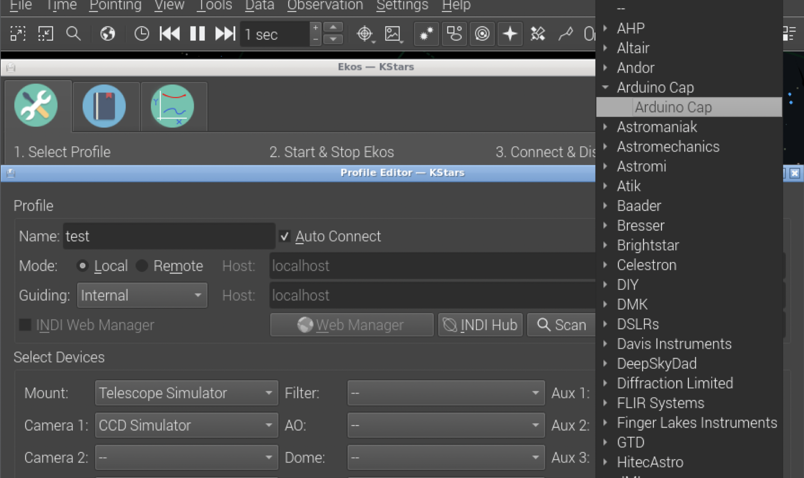
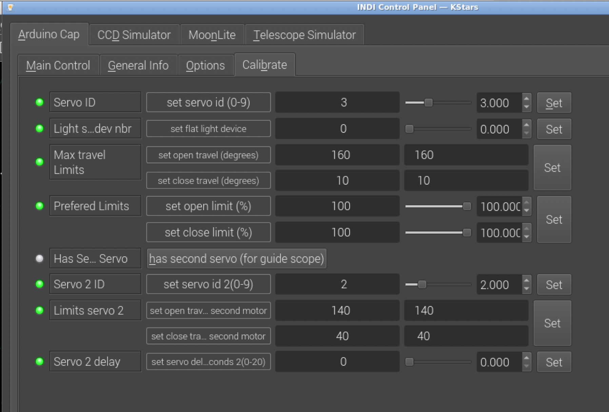
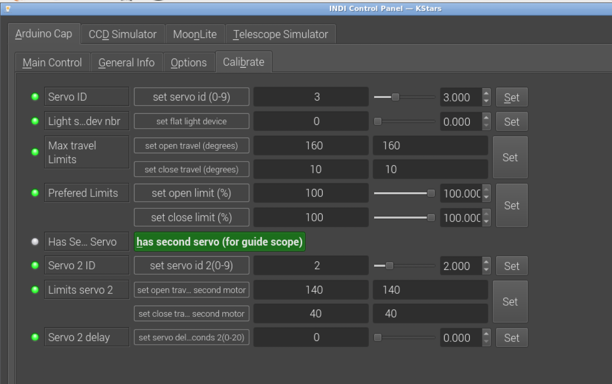

## INDI Arduino Cap
------------------------

### Summary
INDI Arduino Cap is a dust cap 'driver' compatible with INDI and EKOS, that uses the python library pyfirmata.
Arduino Cap uses an Arduino with the StandardFirmata firmware. This will work with a 'rc style' servo on any of the digital PWM outputs. Most servos is 4.8v-7.4v and a old phone charger or similar would work as a powersupply. If you use a servo that is not 4.8v then change powersupply accordingly.

You can also (optionally) install USBRelay2 Roof, and use a relay channel as a (fixed/undimmable) lightsource.

### Attributions
* This project could not be done without the existing INDIlib project or the pyFirmata interface and standard firmata arduino firmware.
* This project is 3rd party and dependent on the mentioned projects, and licensed accordingly. See LICENSE and COPYING.BSD.
* Some files have additional lisence information, see file headers.

### Installing dependencies

If you are using a complete astro distro like astroberry, stellarmate or AstroArch, all kstars and INDI stuff is preinstalled, so that you probably only have to install header files so that you can compile
the driver.

Otherwise you have to install all stuff depending on your operating system.
Generally you need the following software components:

1. **INDILib, and it's dependencies**
    * To build libindi from source [see instructions on indilib.org](http://www.indilib.org/forum/general/210-howto-building-latest-libindi-ekos.html "Link to build libindi")

2. **PyFirmata, and it's dependencies**
    * To install pyFirmata [see this page on pypi.org](https://pypi.org/project/pyFirmata/)

3. **(Optional) INDI USBRelay2 Roof, and it's dependencies**
    * To build USBRelay2 Roof from source [see instructions on github](http://github.com/magnue/indi_usbrelay2_roof "Link to build USBRelay2 Roof")

### Install INDI Arduino Cap

the following steps describe the installation on a Raspberry with stellarmate.

#### System preparation

```bash
sudo apt-get install -y git build-essential libindi-dev libxisf
sudo pip3 install git+https://github.com/tino/pyFirmata.git
```

#### git clone checkout and build

```bash
git clone https://github.com/zworkb/indi_arduino_cap.git
cd indi_arduino_cap/
mkdir build
cd build
cmake -DCMAKE_INSTALL_PREFIX=/usr . ..
make
sudo make install
```

##### update and build

```bash
cd indi_arduino_cap/
cd build
make
sudo make install
```

Important: when kstars is running:

shudown EKOS and kstars and restart, so that the driver gets loaded

### Notes on Stellarmate 2.0

Since Stellarmate 2.0 uses kstars in a flatpak environment many things are different

#### pyfirmata

we have to install pip into the kstars flatpak:

```bash
cd ; git clone https://github.com/tino/pyFirmata.git
flatpak run --command=sh org.kde.kstars -c "python3 -m ensurepip --user"
flatpak run --command=sh org.kde.kstars -c "cd ~/pyFirmata && python3 -m pip install --user ."
```

for convenience I have provided a script `install-flatpak.sh`

just in the root of this project start

```bash
./install-flatpak.sh
```

### Usage

#### Configure driver in your profile

Now that we have installed the driver into the system, we have to configure into our INDI profile.
Therefore you have to select an AUX device, our driver is registered as `Arduino Cap/Arduino Cap`.




#### Calibrate
* Configure Servo ID, Flat Light device, calibrate travel limits, prefered limits, and optionally reverse servo direction.
* To configure a USBRelay2 channel for light source, make sure atleast one Power device is added to the "Device Setup Tab" of USBRelay2 Roof. Take a note of the "dev x" number. In ServoBlaster Cap's "Calibrate tab", set "Flat light device" to "x", and make sure Light Device is set to "use USBRelay2" in ServoBlaster's "Options Tab".




##### Support for secondary servo

Sometimes it is useful to connect a second servo to your arduino to control the cover of your guide scope to a different pin. In this case select the option `has second servo (for guide scope)` and then select the pin (Servo 2 ID)
and the limit parameters similarily as for the main servo.
When you now park/unpark, both covers will be closed/opened subsequentially.




#### Main Control
* Not much to it. Parked = closed, UnParked = open - ready to image.
* Parking Cap will turn off lightsource, and lightsource can only be operated when Cap is unparked.
* To find Max travel limits, use 'step to (degree)' starting at 40, then decreasing until servo does not move any more. This is your close limit. Then set a value of 120 and increase until the servo does not move any more. This is your open limit.
* If servo is moving the wrong direction for the cap to close on park, and open on unpark, then swap one max travellimit for the other, in calibration tab.
* When installing cap for the first time, then set close limit to ~70%, then park. If the cap is not fully closed on the scope, then increase the limit to ~75% and unpark - park. Continue incrementing this until the cap is fully closed on the scope, and you have your preffered close limit.
* If you want the cap only to open to 70% of the open limit, set Prefered limit open to 70%.


